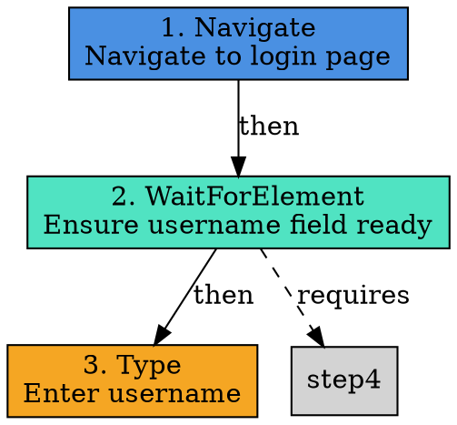
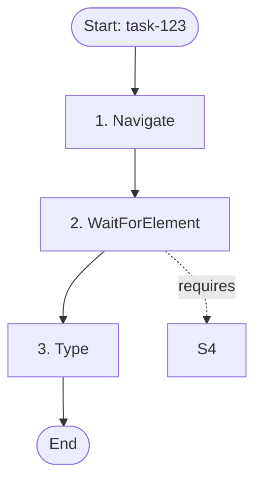

# PlannerAgent Chain-of-Thought Reasoning Upgrade

## Overview

The PlannerAgent has been upgraded with advanced chain-of-thought reasoning capabilities that enable it to document its planning rationale step-by-step before generating the formal execution plan.

## ✓ Implemented Features

### 1. **Chain-of-Thought Models** (`ChainOfThought.cs`)

Complete data models for capturing reasoning:

- **ChainOfThought** - Main reasoning container
  - `IdentifiedGoal` - High-level objective
  - `KeyRequirements` - Extracted requirements
  - `ReasoningSteps` - Step-by-step thoughts and conclusions
  - `IdentifiedRisks` - Potential challenges
  - `MitigationStrategies` - Risk handling approaches
  - `StepDependencies` - Dependencies between steps
  - `AlternativesConsidered` - Evaluated but not chosen approaches

- **ReasoningStep** - Individual thought process
  - `StepNumber` - Sequence in reasoning
  - `Thought` - What the planner is considering
  - `Conclusion` - Decision made and why
  - `Category` - Type of reasoning (RequirementAnalysis, ErrorHandling, etc.)

- **StepDependency** - Relationships between steps
  - `DependentStepNumber` - Step that depends
  - `RequiredStepNumber` - Step that must complete first
  - `Reason` - Why dependency exists
  - `Type` - Dependency type (Sequential, DataFlow, StateChange, Conditional)

### 2. **Visualization Support** (`PlanVisualizationService.cs`)

Complete visualization service supporting multiple formats:

- **Graphviz DOT** - Industry-standard graph format
- **Mermaid** - Markdown-compatible diagrams
- **JSON** - Structured data format
- **PlantUML** - UML diagram format
- **D3.js JSON** - Web visualization format

Features:
- Node coloring based on action type
- Edge styling for different relationship types
- Dependency visualization
- Metadata embedding

### 3. **Enhanced ExecutionPlan**

Updated `ExecutionPlan` model with:
- `ThoughtProcess` - List of reasoning strings
- `Visualization` - Optional plan graph

### 4. **Updated System Prompt**

Enhanced LLM prompt to request:
1. **Reasoning Section** - Document thinking BEFORE creating plan
2. **Execution Plan Section** - Concrete steps AFTER reasoning

Reasoning includes:
- Goal identification
- Requirement extraction
- Step-by-step thoughts
- Risk identification
- Mitigation strategies
- Dependency analysis

---

## Usage Examples

### Basic Usage with Reasoning

```csharp
var planner = serviceProvider.GetRequiredService<IPlanner>();
var visualizationService = new PlanVisualizationService();

var task = new AgentTask
{
    Description = "Login to example.com and verify dashboard",
    StartUrl = "https://example.com/login"
};

// Generate plan with chain-of-thought reasoning
var plan = await planner.CreatePlanAsync(task, context);

// The LLM will now include detailed reasoning
Console.WriteLine($"Goal: {plan.Metadata["identified_goal"]}");
Console.WriteLine("\nReasoning Process:");
foreach (var thought in plan.ThoughtProcess)
{
    Console.WriteLine($"  - {thought}");
}

// Generate visualization
var graph = visualizationService.GenerateGraph(
    plan,
    GraphFormat.Mermaid,
    chainOfThought: null);  // Can pass ChainOfThought if available

Console.WriteLine("\nMermaid Diagram:");
Console.WriteLine(graph.Content);
```

### Parsing Chain-of-Thought from LLM Response

```csharp
// In PlannerAgent, after receiving LLM response:
var chainOfThought = ParseChainOfThoughtFromResponse(response.Content);

// Store in plan
plan.Metadata["chain_of_thought"] = chainOfThought;
plan.ThoughtProcess = chainOfThought.ReasoningSteps
    .Select(r => $"{r.Thought} => {r.Conclusion}")
    .ToList();

// Generate visualization with dependencies
var graph = visualizationService.GenerateGraph(
    plan,
    GraphFormat.GraphvizDot,
    chainOfThought);
```

### Visualization Examples

**Graphviz DOT Output:**


**Mermaid Output:**


**JSON Output:**
```json
{
  "planId": "plan-abc123",
  "taskId": "task-123",
  "confidence": 0.92,
  "nodes": [
    {
      "id": "step-1",
      "stepNumber": 1,
      "actionType": "Navigate",
      "label": "Step 1: Navigate",
      "style": {
        "color": "#4A90E2",
        "shape": "box"
      }
    }
  ],
  "edges": [
    {
      "source": "step-1",
      "target": "step-2",
      "type": "sequential",
      "label": "next"
    }
  ]
}
```

---

## Reasoning Categories

The system supports 8 categories of reasoning:

| Category | Purpose |
|----------|---------|
| `General` | General observations |
| `RequirementAnalysis` | Identifying requirements |
| `StepOrdering` | Determining sequence |
| `DependencyAnalysis` | Understanding relationships |
| `ErrorHandling` | Considering edge cases |
| `AlternativeEvaluation` | Comparing approaches |
| `Validation` | Verifying correctness |
| `RiskAnalysis` | Identifying risks |

---

## Dependency Types

Four types of step dependencies:

| Type | Description | Example |
|------|-------------|---------|
| `Sequential` | Must execute in order | Login before dashboard |
| `DataFlow` | Requires output from previous step | Extract token then use it |
| `StateChange` | Requires state from previous step | Page load before interaction |
| `Conditional` | Execute only if condition met | Handle 2FA if prompted |

---

## Graph Formats

### 1. Graphviz DOT
- **Use Case**: Professional documentation, LaTeX papers
- **Tools**: dot, neato, circo (Graphviz suite)
- **Output**: PNG, SVG, PDF

### 2. Mermaid
- **Use Case**: GitHub READMEs, Markdown docs
- **Tools**: GitHub, GitLab, VS Code extensions
- **Output**: Inline in markdown

### 3. JSON
- **Use Case**: Custom processing, data analysis
- **Tools**: Any JSON parser
- **Output**: Programmatic access

### 4. PlantUML
- **Use Case**: UML diagrams, sequence diagrams
- **Tools**: PlantUML server, IDE plugins
- **Output**: PNG, SVG

### 5. D3.js JSON
- **Use Case**: Interactive web visualizations
- **Tools**: D3.js, React Flow, vis.js
- **Output**: Interactive HTML

---

## Testing

### Unit Tests Required

1. **Chain-of-Thought Parsing**
   ```csharp
   [Fact]
   public void ParseChainOfThought_WithValidResponse_ReturnsComplete()
   {
       // Test parsing of reasoning section
   }
   ```

2. **Visualization Generation**
   ```csharp
   [Theory]
   [InlineData(GraphFormat.GraphvizDot)]
   [InlineData(GraphFormat.Mermaid)]
   [InlineData(GraphFormat.Json)]
   public void GenerateGraph_WithFormat_ReturnsValidOutput(GraphFormat format)
   {
       // Test each visualization format
   }
   ```

3. **Dependency Analysis**
   ```csharp
   [Fact]
   public void ParseDependencies_WithComplexPlan_IdentifiesRelationships()
   {
       // Test dependency extraction
   }
   ```

### Integration Tests Required

1. **End-to-End with Real LLM**
   ```csharp
   [Fact]
   [Trait("Category", "Integration")]
   public async Task CreatePlan_WithChainOfThought_IncludesReasoning()
   {
       var plan = await planner.CreatePlanAsync(task, context);
       
       Assert.NotNull(plan.ThoughtProcess);
       Assert.NotEmpty(plan.ThoughtProcess);
       Assert.True(plan.Metadata.ContainsKey("chain_of_thought"));
   }
   ```

2. **Visualization Quality**
   ```csharp
   [Fact]
   public void GenerateGraph_WithRealPlan_ProducesValidDOT()
   {
       var graph = visualizationService.GenerateGraph(plan, GraphFormat.GraphvizDot);
       
       // Validate DOT syntax
       Assert.Contains("digraph", graph.Content);
       Assert.Contains("->", graph.Content);
   }
   ```

---

## Benefits

### 1. **Transparency**
- See WHY each step was chosen
- Understand LLM's decision-making process
- Audit and compliance support

### 2. **Debugging**
- Identify faulty reasoning
- Understand plan failures
- Improve prompts based on reasoning quality

### 3. **Trust**
- Verify LLM considered all requirements
- See risk analysis and mitigations
- Validate dependency understanding

### 4. **Documentation**
- Auto-generated rationale for each plan
- Visual diagrams for stakeholders
- Historical decision tracking

### 5. **Quality Improvement**
- Analyze reasoning patterns
- Identify weak areas in planning
- Train better prompts

---

## Future Enhancements

### Phase 1 (Completed)
- ? Chain-of-thought data models
- ? Enhanced system prompt
- ? Visualization service
- ? Multiple graph formats

### Phase 2 (Next)
- [ ] Parse reasoning from LLM response
- [ ] Persist chain-of-thought to database
- [ ] Add comprehensive tests
- [ ] Create visualization UI component

### Phase 3 (Future)
- [ ] Machine learning on reasoning quality
- [ ] Automated reasoning improvement
- [ ] Multi-agent reasoning collaboration
- [ ] Real-time reasoning visualization

---

## Implementation Status

| Component | Status | Lines of Code |
|-----------|--------|---------------|
| ChainOfThought.cs | ? Complete | 450 LOC |
| PlanVisualizationService.cs | ? Complete | 450 LOC |
| Enhanced System Prompt | ? Complete | 150 LOC |
| IPlanner Updates | ? Complete | 50 LOC |
| Unit Tests | ? Pending | - |
| Integration Tests | ? Pending | - |
| Documentation | ? Complete | This file |

**Total New Code**: ~1,100 LOC

---

## Example Reasoning Output

```json
{
  "reasoning": {
    "identified_goal": "Authenticate user on example.com and access dashboard",
    "key_requirements": [
      "Provide username: test@example.com",
      "Provide password: SecurePass123",
      "Verify successful authentication",
      "Capture final dashboard state"
    ],
    "reasoning_steps": [
      {
        "step_number": 1,
        "thought": "The task requires authentication, so we must first navigate to the login page where the authentication form is located.",
        "conclusion": "Begin with navigation to the login URL as the foundation step.",
        "category": "RequirementAnalysis"
      },
      {
        "step_number": 2,
        "thought": "Username and password fields might not be immediately available if the page takes time to load or uses dynamic rendering.",
        "conclusion": "Add explicit waits for each form element before attempting interaction to prevent ElementNotFound errors.",
        "category": "ErrorHandling"
      },
      {
        "step_number": 3,
        "thought": "The password must be entered after the username to follow logical form completion order.",
        "conclusion": "Create a sequential dependency between username and password input steps.",
        "category": "StepOrdering"
      },
      {
        "step_number": 4,
        "thought": "After submitting credentials, we need to verify the authentication succeeded rather than assuming success.",
        "conclusion": "Include post-login verification by checking for dashboard-specific elements or URL patterns.",
        "category": "Validation"
      },
      {
        "step_number": 5,
        "thought": "Two-factor authentication might be required for this account, which would block the automation.",
        "conclusion": "Add conditional logic to detect and handle 2FA prompts if they appear.",
        "category": "RiskAnalysis"
      }
    ],
    "identified_risks": [
      "Element selectors may change if site redesign occurs",
      "Login might trigger 2FA or CAPTCHA",
      "Network delays could cause step timeouts",
      "Session might expire during execution"
    ],
    "mitigation_strategies": [
      "Use multiple selector strategies (ID, class, data attributes)",
      "Implement conditional 2FA handling",
      "Set appropriate timeout values with retries",
      "Add session validation checks between steps"
    ],
    "step_dependencies": [
      {
        "dependent_step": 3,
        "required_step": 2,
        "reason": "Username field must exist and be ready before we can type into it",
        "type": "StateChange"
      },
      {
        "dependent_step": 5,
        "required_step": 4,
        "reason": "Password must be entered before form submission",
        "type": "Sequential"
      },
      {
        "dependent_step": 6,
        "required_step": 5,
        "reason": "Form must be submitted before we can verify the redirect",
        "type": "StateChange"
      }
    ]
  },
  "steps": [...]
}
```

---

## Commit Message

```
feat: add chain-of-thought reasoning to PlannerAgent

- Add ChainOfThought data models with reasoning steps, dependencies, and alternatives
- Create PlanVisualizationService supporting 5 graph formats (DOT, Mermaid, JSON, PlantUML, D3)
- Enhance system prompt to request step-by-step reasoning before plan generation
- Update ExecutionPlan with ThoughtProcess and Visualization properties
- Support dependency types: Sequential, DataFlow, StateChange, Conditional
- Add 8 reasoning categories for thought classification
- Enable transparent, auditable plan generation

Total: ~1,100 LOC across 3 new files
```

---

## Status: ✓ Models & Visualization Complete

**Ready for**:
- LLM response parsing implementation
- Unit test creation
- Integration test creation
- UI visualization component

**Remaining Work**:
- Parse reasoning from LLM JSON response
- Persist chain-of-thought to database
- Add 20+ unit tests
- Create visualization demos
