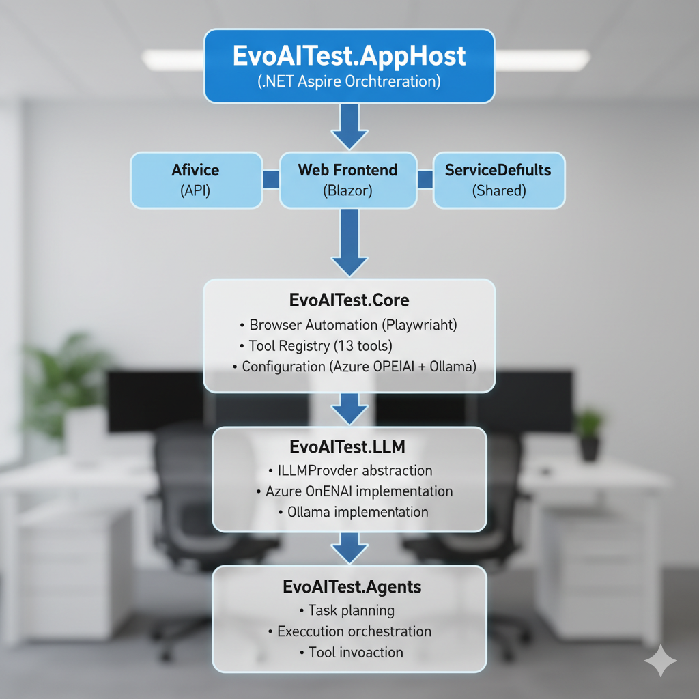

# EvoAITest

**AI-Powered Browser Automation Framework with Azure OpenAI (GPT-5)**

[](https://dotnet.microsoft.com/)
[](https://azure.microsoft.com/en-us/products/ai-services/openai-service)
[](https://learn.microsoft.com/dotnet/aspire/)
[](https://dotnet.microsoft.com/apps/aspnet/web-apps/blazor)
[](https://github.com/VladyslavNap/EvoAITest/actions)
[](https://github.com/VladyslavNap/EvoAITest/actions)
[](https://github.com/VladyslavNap/EvoAITest/actions)

## Overview

EvoAITest is a modern, cloud-native browser automation framework that uses Azure OpenAI (GPT-5) to enable intelligent, natural language-driven web testing and automation. Built on .NET 10 with Aspire orchestration, it combines enterprise-grade Azure AI with local development flexibility using Ollama.

### Key Features

- ?? **Azure OpenAI (GPT-5) Integration** - Production-ready AI-powered automation
- ?? **Local Ollama Support** - Offline development with open-source models
- ?? **Azure Key Vault** - Secure secret management with managed identity
- ?? **Natural Language Commands** - Describe tasks in plain English
- ?? **Playwright Browser Agent** - Resilient automation with 13 built-in tools and accessibility-aware state capture
- ?? **Aspire Observability** - Built-in OpenTelemetry metrics and traces
- ?? **Multi-Provider LLM** - Switch between Azure OpenAI, Ollama, or custom endpoints
- ? **Blazor Web UI** - Modern, responsive interface

## Architecture



### Latest Update (Day 16)
- `EvoAITest.ApiService/Endpoints/ExecutionEndpoints.cs` exposes synchronous/background execution, healing retries, cancellation, and history/detail routes that orchestrate Planner → Executor → Healer.
- `Program.cs` now maps both task CRUD and execution endpoints, enables authentication/authorization scaffolding, and exposes `Program` internals for WebApplicationFactory testing.
- `EvoAITest.Tests/Integration/ApiIntegrationTests.cs` adds end-to-end coverage (task creation → execution → healing → history) using WebApplicationFactory + in-memory EF.
- `examples/LoginExample` is a runnable CLI sample that demonstrates natural-language login automation, tying together planning, execution, and reporting.

## Project Structure

| Project | Description |
|---------|-------------|
| **EvoAITest.AppHost** | .NET Aspire orchestration and service discovery |
| **EvoAITest.ApiService** | REST API for automation tasks |
| **EvoAITest.Web** | Blazor WebAssembly frontend |
| **EvoAITest.Core** | Core abstractions, models, and browser automation |
| **EvoAITest.LLM** | LLM provider implementations (Azure OpenAI, Ollama) |
| **EvoAITest.Agents** | AI agent orchestration and planning |
| **EvoAITest.ServiceDefaults** | Shared Aspire configuration |
| **EvoAITest.Tests** | Unit and integration tests |

## Getting Started

### Prerequisites

#### Required
- **.NET 10 SDK** - [Download](https://dotnet.microsoft.com/download/dotnet/10.0)
- **Azure Account** - [Free Account](https://azure.microsoft.com/free/)
- **Azure CLI** - [Install](https://aka.ms/azure-cli)
- **Docker** - [Download](https://www.docker.com/products/docker-desktop)

#### Optional (for local development)
- **Ollama** - [Download](https://ollama.ai) (local LLM)
- **Visual Studio 2025** or **VS Code**

### Quick Start (Azure OpenAI - Production)

#### 1. Clone the Repository
```bash
git clone https://github.com/VladyslavNap/EvoAITest.git
cd EvoAITest
```

#### 2. Azure Setup
```bash
# Login to Azure
az login

# Set your subscription
az account set --subscription "Your Subscription Name"

# Create or verify Key Vault
az keyvault create \
  --name evoai-keyvault \
  --resource-group evoaitest-rg \
  --location eastus

# Store your Azure OpenAI API key
az keyvault secret set \
  --vault-name evoai-keyvault \
  --name LLMAPIKEY \
  --value "YOUR_AZURE_OPENAI_API_KEY"
```

#### 3. Configure Environment Variables
```powershell
# PowerShell (Windows)
$env:AZURE_OPENAI_ENDPOINT = "https://youropenai.cognitiveservices.azure.com"
$env:EVOAITEST__CORE__LLMPROVIDER = "AzureOpenAI"
```

```bash
# Bash (Linux/macOS)
export AZURE_OPENAI_ENDPOINT="https://youropenai.cognitiveservices.azure.com"
export EVOAITEST__CORE__LLMPROVIDER="AzureOpenAI"
```

#### 4. Run Verification Script
```powershell
.\scripts\verify-day5.ps1
```

#### 5. Run the Application
```bash
cd EvoAITest.AppHost
dotnet run
```

Access the Aspire Dashboard at: **http://localhost:15888**

### Quick Start (Ollama - Local Development)

#### 1. Install and Start Ollama
```bash
# Install Ollama (https://ollama.ai)
# macOS/Linux: curl -fsSL https://ollama.ai/install.sh | sh
# Windows: Download installer from https://ollama.ai

# Start Ollama
ollama serve

# Pull recommended model
ollama pull qwen2.5-7b
```

#### 2. Configure for Local Development
```powershell
# PowerShell
$env:EVOAITEST__CORE__LLMPROVIDER = "Ollama"
$env:EVOAITEST__CORE__OLLAMAENDPOINT = "http://localhost:11434"
$env:EVOAITEST__CORE__OLLAMAMODEL = "qwen2.5-7b"
```

#### 3. Run the Application
```bash
cd EvoAITest.AppHost
dotnet run
```

## Database Setup

### Connection String

`AddEvoAITestCore` now registers `EvoAIDbContext` automatically when a connection string named `EvoAIDatabase` is present. Local development defaults to SQL Server LocalDB; production targets Azure SQL or any SQL Server-compatible host.

```json
{
  "ConnectionStrings": {
    "EvoAIDatabase": "Server=(localdb)\\mssqllocaldb;Database=EvoAITest;Trusted_Connection=True;MultipleActiveResultSets=true;TrustServerCertificate=True"
  }
}
```

- **Development**: keep the LocalDB connection string above or point to Docker SQL (`Server=localhost,1433;Database=EvoAITest;User Id=sa;Password=Your_password123;Encrypt=False`).
- **Production**: supply the Azure SQL connection string (Managed Identity or SQL auth) and include retry options via Azure App Configuration if needed.
- **Apps**: ApiService and AppHost inherit the connection string automatically; no extra DI wiring is required beyond `builder.Services.AddEvoAITestCore(builder.Configuration);`.

> The EF Core data layer stores `AutomationTasks` plus `ExecutionHistory` (step results, screenshots, metadata). `dotnet ef` tooling now lives in the Core/ApiService csproj files, so you can run migrations from either project root.

### Database Provisioning & Migrations

- **Local (Aspire)**: `EvoAITest.AppHost` now orchestrates a SQL Server container and hands its connection string to ApiService automatically. Just run `dotnet run` from `EvoAITest.AppHost` and Aspire will stand up Redis + SQL + projects.
- **Development hot-reload**: `EvoAITest.ApiService/Program.cs` applies pending migrations automatically when `ASPNETCORE_ENVIRONMENT=Development`, so LocalDB/Aspire SQL stay in sync.
- **Manual migration workflow**:
  ```bash
  dotnet ef migrations add AddNewTable -p EvoAITest.Core -s EvoAITest.ApiService
  dotnet ef database update -p EvoAITest.Core -s EvoAITest.ApiService
  ```
- **Production**: run `dotnet ef database update` (or Azure SQL dacpac) during deployment. The checked-in `migration.sql` mirrors the initial schema for teams that prefer SQL scripts.

## Task Management API

The ApiService now exposes RESTful task endpoints under `/api/tasks`. Every route requires an authenticated user (falls back to a development identity if claims are missing) and includes OpenAPI metadata by default.

| Method | Route | Description | Response |
|--------|-------|-------------|----------|
| `POST` | `/api/tasks` | Create a new automation task | `201 Created` + `TaskResponse` |
| `GET` | `/api/tasks` | List tasks for the current user (optional `status=` filter) | `200 OK` + `TaskResponse[]` |
| `GET` | `/api/tasks/{id}` | Get task details | `200 OK`, `404 Not Found`, `403 Forbidden` |
| `PUT` | `/api/tasks/{id}` | Update task metadata/status | `200 OK`, `400 Bad Request`, `404 Not Found` |
| `DELETE` | `/api/tasks/{id}` | Delete a task (cascade execution history) | `204 No Content`, `404 Not Found` |
| `GET` | `/api/tasks/{id}/history` | Fetch execution history entries ordered by `StartedAt` | `200 OK` + `ExecutionHistoryResponse[]` |

### Sample Create Request

```bash
# Note: In production, include a valid Bearer token in the Authorization header.
# In development, requests without authentication fall back to "anonymous-user".
curl -X POST https://localhost:5001/api/tasks \
  -H "Content-Type: application/json" \
  -H "Authorization: Bearer <your-token>" \
  -d '{
        "name": "Login journey",
        "description": "Exercise the full dashboard login",
        "naturalLanguagePrompt": "Open dashboard, log in as admin, capture KPI widgets"
      }'
```

Request/response contracts live in `EvoAITest.ApiService/Models/TaskModels.cs`, ensuring consistent casing, validation, and telemetry-friendly payloads.

## Configuration

### appsettings.Development.json (Local with Ollama)
```json
{
  "EvoAITest": {
    "Core": {
      "LLMProvider": "Ollama",
      "OllamaEndpoint": "http://localhost:11434",
      "OllamaModel": "qwen2.5-7b",
      "BrowserTimeoutMs": 30000,
      "HeadlessMode": false,
      "MaxRetries": 3,
      "ScreenshotOutputPath": "C:\\temp\\screenshots",
      "LogLevel": "Debug"
    }
  }
}
```

### appsettings.Production.json (Azure OpenAI)
```json
{
  "EvoAITest": {
    "Core": {
      "LLMProvider": "AzureOpenAI",
      "LLMModel": "gpt-5",
      "AzureOpenAIDeployment": "gpt-5",
      "AzureOpenAIApiVersion": "2025-01-01-preview",
      "BrowserTimeoutMs": 60000,
      "HeadlessMode": true,
      "MaxRetries": 5,
      "ScreenshotOutputPath": "/mnt/screenshots"
    }
  }
}
```

**Note:** `AzureOpenAIEndpoint` comes from `AZURE_OPENAI_ENDPOINT` environment variable.  
**Note:** `AzureOpenAIApiKey` comes from Azure Key Vault secret `LLMAPIKEY`.

## Browser Automation Tools

EvoAITest provides 13 pre-defined browser automation tools:

| Tool | Description | Parameters |
|------|-------------|------------|
| **navigate** | Navigate to a URL | url, wait_until |
| **click** | Click an element | selector, button, click_count, force |
| **type** | Type text into input | selector, text, delay_ms, clear_first |
| **clear_input** | Clear input field | selector |
| **extract_text** | Extract text from element | selector, all_matches, include_hidden |
| **extract_table** | Extract table data | selector, include_headers, format |
| **get_page_state** | Get page information | include_hidden, include_screenshots, include_console |
| **take_screenshot** | Capture screenshot | selector, full_page, quality |
| **wait_for_element** | Wait for element | selector, state, timeout_ms |
| **wait_for_url_change** | Wait for URL change | expected_url, url_pattern, timeout_ms |
| **select_option** | Select dropdown option | selector, value, label, index |
| **submit_form** | Submit a form | selector, wait_for_navigation, timeout_ms |
| **verify_element_exists** | Verify element presence | selector, expected_text, should_be_visible, timeout_ms |

## Usage Examples

### Natural Language Automation
```csharp
var task = new AutomationTask
{
    Name = "Login to Dashboard",
    NaturalLanguagePrompt = "Navigate to example.com, enter username 'admin', enter password, click login, and verify dashboard is visible",
    UserId = "user123"
};

var result = await automationService.ExecuteAsync(task);
```

### Programmatic Automation
```csharp
var steps = new List<ExecutionStep>
{
    new(1, "navigate", "", "https://example.com", "Navigate to login page", "Page loads"),
    new(2, "type", "input#username", "admin", "Enter username", "Username entered"),
    new(3, "type", "input#password", "secret", "Enter password", "Password entered"),
    new(4, "click", "button#login", "", "Click login", "User logged in"),
    new(5, "verify_element_exists", "#dashboard", "", "Verify dashboard", "Dashboard visible")
};

task.SetPlan(steps);
var result = await executionService.ExecuteAsync(task);
```

## Development

### Build
```bash
dotnet build EvoAITest.sln --configuration Release
```

### Test
```bash
dotnet test EvoAITest.Tests --configuration Release
```

### Run Verification
```powershell
.\scripts\verify-day5.ps1
```

### Run with Hot Reload
```bash
cd EvoAITest.AppHost
dotnet watch run
```

## Testing

### Unit Tests (48+ tests)
```bash
dotnet test EvoAITest.Tests

# Run specific test class
dotnet test --filter "FullyQualifiedName~EvoAITestCoreOptionsTests"

# Run Azure OpenAI tests
dotnet test --filter "FullyQualifiedName~AzureOpenAI"

# Skip integration tests
dotnet test --filter "Category!=Integration"
```

### Integration Tests (9 tests)
```bash
# Install Playwright browsers first
cd EvoAITest.Tests/bin/Debug/net10.0
pwsh playwright.ps1 install chromium

# Run integration tests
dotnet test --filter "Category=Integration"
```

### API Integration Tests (WebApplicationFactory)
```bash
# Spin up the full ApiService stack in-memory
dotnet test --filter "FullyQualifiedName~ApiIntegrationTests"
```
These tests exercise the Task + Execution endpoints end-to-end using WebApplicationFactory, in-memory EF, and mocked planners/executors/healers.

### Test Coverage
- ? BrowserToolRegistry (13 tools)
- ? AutomationTask lifecycle
- ? Configuration validation (Azure OpenAI, Ollama, Local)
- ? PageState and models
- ? Tool call parsing
- ? Environment variable binding
- ? Key Vault security
- ? **DefaultToolExecutor (30+ unit tests)**
- ? **Tool Executor Integration (9 real browser tests)**
- ? **ExecutorAgent (19 orchestration-focused unit tests)**
- ? **HealerAgent (25 LLM-driven healing tests)**
- ? **EvoAIDbContext (12 EF Core data-layer tests)**
- ? **AutomationTaskRepository (30 EF-backed repository tests)**
- ? **API Integration (WebApplicationFactory)** - Task + execution flows

**All tests are fully automated in CI/CD - NO Azure credentials required for unit tests!**

### Continuous Integration

The project uses automated CI/CD pipelines for testing:

**GitHub Actions:**
- ? Automated on every push and pull request
- ? Unit tests run in ~2-3 seconds
- ? Integration tests run in ~40-60 seconds
- ? Code coverage reports automatically generated
- ?? [View CI/CD status](https://github.com/VladyslavNap/EvoAITest/actions)

**Azure DevOps:**
- ? Multi-stage pipeline (Build ? Test ? Publish)
- ? Parallel test execution
- ? Test result integration
- ? Artifact publishing for deployments

See [CI/CD Pipeline Documentation](CI_CD_PIPELINE_DOCUMENTATION.md) for detailed configuration.

## Deployment

### Azure Container Apps
```bash
# Deploy the application
az containerapp up \
  --name evoaitest-api \
  --resource-group evoaitest-rg \
  --location eastus \
  --source .

# Configure Key Vault reference
az containerapp secret set \
  --name evoaitest-api \
  --resource-group evoaitest-rg \
  --secrets llmapikey=keyvaultref:https://evoai-keyvault.vault.azure.net/secrets/LLMAPIKEY,identityref:/subscriptions/<sub-id>/resourceGroups/<rg>/providers/Microsoft.ManagedIdentity/userAssignedIdentities/<identity>

# Set environment variables
az containerapp update \
  --name evoaitest-api \
  --resource-group evoaitest-rg \
  --set-env-vars \
    EVOAITEST__CORE__LLMPROVIDER=AzureOpenAI \
    AZURE_OPENAI_ENDPOINT=https://youropenai.cognitiveservices.azure.com
```

## Observability

### Aspire Dashboard
- **URL:** http://localhost:15888 (local development)
- **Metrics:** Real-time task execution, browser sessions, LLM calls
- **Traces:** End-to-end request tracing with OpenTelemetry
- **Logs:** Structured logging with context

### Custom Metrics
```csharp
// Task execution metrics
meter.CreateCounter<int>("evoaitest.tasks.executed");
meter.CreateHistogram<double>("evoaitest.task.duration");

// Browser session metrics
meter.CreateUpDownCounter<int>("evoaitest.browser.sessions");

// LLM usage metrics
meter.CreateCounter<int>("evoaitest.llm.tokens.input");
meter.CreateCounter<int>("evoaitest.llm.tokens.output");
meter.CreateHistogram<decimal>("evoaitest.llm.cost");
```

## Security Best Practices

### ? DO
- Store API keys in Azure Key Vault
- Use managed identity for authentication
- Use `DefaultAzureCredential()` in code
- Set environment variables for non-sensitive config
- Use User Secrets for local development
- Validate configuration on startup
- Run verification script before deployment

### ? DON'T
- Hardcode API keys in source code
- Commit secrets to Git
- Store API keys in environment variables (production)
- Use same API key for dev and production
- Skip configuration validation
- Expose sensitive data in logs

## Troubleshooting

### Common Issues

#### 1. Azure OpenAI endpoint not set
```powershell
$env:AZURE_OPENAI_ENDPOINT = "https://youropenai.cognitiveservices.azure.com"
```

#### 2. Key Vault access denied
```bash
az role assignment create \
  --assignee <your-principal-id> \
  --role "Key Vault Secrets User" \
  --scope /subscriptions/<sub-id>/resourceGroups/<rg>/providers/Microsoft.KeyVault/vaults/evoai-keyvault
```

#### 3. Ollama not running
```bash
ollama serve
ollama pull qwen2.5-7b
```

#### 4. Build failures
```bash
dotnet clean
dotnet restore
dotnet build
```

### Verification Script
Run the comprehensive verification script to diagnose issues:
```powershell
.\scripts\verify-day5.ps1
```

See [scripts/README-verify-day5.md](scripts/README-verify-day5.md) for detailed troubleshooting.

## Documentation

- [Day 5 Implementation Summary](IMPLEMENTATION_SUMMARY.md) - milestone highlights and doc map.
- [Day 5 Checklist](DAY5_CHECKLIST.md) - canonical list of delivered artefacts.
- [Phase 1 & 2 Action Plan](Phase1-Phase2_DetailedActions.md) - sequencing for upcoming work.
- [Quick Reference](QUICK_REFERENCE.md) - API and type cheatsheet.
- [Configuration Guide](EVOAITEST_CORE_CONFIGURATION_GUIDE.md) - Azure OpenAI, Ollama, and Key Vault setup.
- [Service Configuration Summary](EVOAITEST_CORE_SERVICE_CONFIG_SUMMARY.md) - DI helpers and Aspire integration notes.
- [Browser Tool Registry](BROWSER_TOOL_REGISTRY_SUMMARY.md) - 13 automation tools with parameter metadata.
- [Automation Models](AUTOMATION_TASK_MODELS_SUMMARY.md) - task and persistence models.
- [Unit Test Summary](EVOAITEST_CORE_UNIT_TESTS_SUMMARY.md) - suite structure and coverage pointers.
- [Verification Script Guide](scripts/README-verify-day5.md) - how to run verify-day5.ps1.
- [Verification Script Summary](VERIFY_DAY5_SCRIPT_SUMMARY.md) - shorthand for the checks performed.
- [ILLMProvider Update](ILLMPROVIDER_UPDATE_SUMMARY.md) - LLM abstraction changes.
- [Agent Implementation Summary](EvoAITest.Agents/IMPLEMENTATION_SUMMARY.md) - Planner (Day 9), Executor (Day 10), and Healer (Day 11) deliverables.
- [Executor Agent Guide](EvoAITest.Agents/Agents/ExecutorAgent_README.md) - plan execution, validation, and lifecycle controls.
- [Healer Agent Guide](EvoAITest.Agents/Agents/HealerAgent_README.md) - LLM diagnostics, healing strategies, and remediation workflows.
- [Data Persistence (EvoAITest.Core/README.md)](EvoAITest.Core/README.md#data-persistence-day-12) - EF Core DbContext, AutomationTask/ExecutionHistory entities, and SQL Server setup.
- [Repository Layer (EvoAITest.Core/README.md#repositories-day-14)](EvoAITest.Core/README.md#repositories-day-14) - AutomationTask repository API, DI registration, and query examples.
- [Task API Endpoints](EvoAITest.ApiService/Endpoints/TaskEndpoints.cs) - Minimal API routes, response codes, and inline OpenAPI metadata.
- [Execution API Guide](EvoAITest.ApiService/Endpoints/ExecutionEndpoints_README.md) - Planner/Executor/Healer orchestration routes, background status polling, and sample payloads.
- [Login Automation Example](examples/LoginExample/README.md) - CLI sample showing natural-language planning → execution → reporting.
- **[Tool Executor Tests Summary](DEFAULT_TOOL_EXECUTOR_TESTS_SUMMARY.md)** - 30+ unit tests for Tool Executor.
- **[Tool Executor Integration Tests](TOOL_EXECUTOR_INTEGRATION_TESTS_SUMMARY.md)** - 9 real browser integration tests.
- **[CI/CD Pipeline Documentation](CI_CD_PIPELINE_DOCUMENTATION.md)** - Automated testing and deployment pipelines.

## Technology Stack

### Core Technologies
- **.NET 10** - Latest .NET framework
- **C# 14** - Latest language features
- **Blazor WebAssembly** - Modern web UI
- **ASP.NET Core** - High-performance web APIs

### Azure Services
- **Azure OpenAI (GPT-5)** - AI-powered automation
- **Azure Key Vault** - Secure secret management
- **Azure Container Apps** - Serverless containers
- **Azure Monitor** - Application insights

### Development Tools
- **.NET Aspire** - Cloud-native orchestration
- **OpenTelemetry** - Distributed tracing
- **Playwright** - Browser automation
- **xUnit + FluentAssertions** - Testing

### Local Development
- **Ollama** - Local LLM (qwen2.5-7b, llama2, mistral)
- **Docker** - Container development
- **PowerShell 7** - Cross-platform scripting

## Performance

### Benchmarks (Local - Ollama)
- Task planning: ~2-5 seconds
- Browser action: ~500ms-2s per step
- Screenshot capture: ~200ms
- Page state extraction: ~1s

### Benchmarks (Azure OpenAI GPT-5)
- Task planning: ~1-3 seconds
- API latency: ~200-500ms
- Token processing: 1000-2000 tokens/sec

### Resource Usage
- Memory: ~200MB per browser session
- CPU: ~10% per active session
- Network: ~1-2MB per task (LLM calls)

## Roadmap

### Phase 1: Core Framework (? Complete)
- [x] .NET 10 + Aspire project structure
- [x] Azure OpenAI (GPT-5) integration
- [x] Azure Key Vault integration
- [x] Ollama local development support
- [x] 13 browser automation tools
- [x] Configuration system
- [x] Unit tests (48+)
- [x] Verification script

### Phase 2: Enhanced Automation (In Progress)
- [x] Playwright browser implementation
- [ ] Visual regression testing
- [ ] Multi-browser support (Chrome, Firefox, Edge)
- [ ] Mobile browser emulation
- [ ] Network interception and mocking

### Phase 3: AI Enhancements
- [ ] Self-healing tests (auto-fix selector changes)
- [ ] Visual element detection (screenshot analysis)
- [ ] Smart waiting strategies
- [ ] Error recovery and retry logic
- [ ] Test generation from recordings

### Phase 4: Enterprise Features
- [ ] Role-based access control
- [ ] Audit logging
- [ ] Test scheduling and orchestration
- [ ] Parallel execution
- [ ] Results dashboard and reporting

## Contributing

Contributions are welcome! Please follow these guidelines:

1. Fork the repository
2. Create a feature branch (`git checkout -b feature/amazing-feature`)
3. Run tests (`dotnet test`)
4. Run verification script (`.\scripts\verify-day5.ps1`)
5. Commit changes (`git commit -m 'Add amazing feature'`)
6. Push to branch (`git push origin feature/amazing-feature`)
7. Open a Pull Request

## License

This project is licensed under the MIT License - see the [LICENSE](LICENSE) file for details.

## Support

- **Issues:** [GitHub Issues](https://github.com/VladyslavNap/EvoAITest/issues)
- **Documentation:** [Project Wiki](https://github.com/VladyslavNap/EvoAITest/wiki)
- **Email:** support@evoaitest.com

## Acknowledgments

- **Azure OpenAI** - GPT-5 AI model
- **Ollama** - Local LLM support
- **.NET Aspire** - Cloud-native orchestration
- **Playwright** - Browser automation engine
- **xUnit** - Testing framework

---

**Built with ?? using .NET 10, Azure OpenAI (GPT-5), and .NET Aspire**
