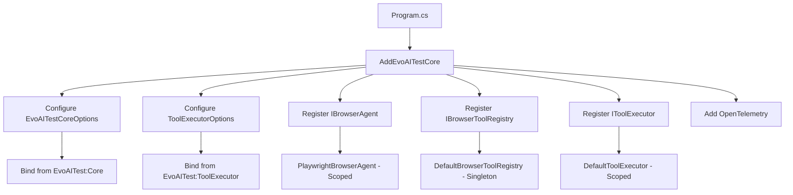

# Tool Executor DI Wiring - Complete

> **Status**: ? **COMPLETE** - Tool Executor fully wired into dependency injection with configuration binding

## Overview

Successfully wired the `IToolExecutor` service into the dependency injection system following the existing patterns from `EvoAITest.LLM` and `EvoAITest.Core`. The executor is now available in both the API service and Blazor Web projects.

## Files Modified

### 1. ServiceCollectionExtensions.cs ?
**Location:** `EvoAITest.Core/Extensions/ServiceCollectionExtensions.cs`

**Changes:**
- Enhanced `AddEvoAITestCore` XML documentation to mention all registered services
- Added dedicated `AddToolExecutor()` extension method
- Added generic `AddToolExecutor<TExecutor>()` for custom implementations
- Updated documentation with configuration structure examples

**New Methods:**
```csharp
/// <summary>
/// Adds the browser automation tool executor to the service collection.
/// </summary>
public static IServiceCollection AddToolExecutor(this IServiceCollection services)
{
    services.TryAddScoped<IToolExecutor, DefaultToolExecutor>();
    return services;
}

/// <summary>
/// Adds a custom tool executor implementation.
/// </summary>
public static IServiceCollection AddToolExecutor<TExecutor>(this IServiceCollection services)
    where TExecutor : class, IToolExecutor
{
    services.TryAddScoped<IToolExecutor, TExecutor>();
    return services;
}
```

### 2. Configuration Files ?

#### EvoAITest.ApiService/appsettings.json
Added complete configuration structure:
```json
{
  "EvoAITest": {
    "Core": {
      "LLMProvider": "AzureOpenAI",
      "LLMModel": "gpt-5",
      "BrowserTimeoutMs": 30000,
      "HeadlessMode": true,
      "MaxRetries": 3,
      "ScreenshotOutputPath": "/tmp/screenshots",
      "LogLevel": "Information",
      "EnableTelemetry": true,
      "ServiceName": "EvoAITest.ApiService"
    },
    "ToolExecutor": {
      "MaxRetries": 3,
      "InitialRetryDelayMs": 500,
      "MaxRetryDelayMs": 10000,
      "UseExponentialBackoff": true,
      "MaxConcurrentTools": 1,
      "TimeoutPerToolMs": 30000,
      "EnableDetailedLogging": true,
      "MaxHistorySize": 100
    }
  }
}
```

#### EvoAITest.ApiService/appsettings.Development.json
Development-optimized settings:
```json
{
  "EvoAITest": {
    "Core": {
      "LLMProvider": "Ollama",
      "OllamaEndpoint": "http://localhost:11434",
      "OllamaModel": "qwen2.5:32b",
      "HeadlessMode": false,
      "BrowserTimeoutMs": 30000,
      "MaxRetries": 3,
      "LogLevel": "Debug"
    },
    "ToolExecutor": {
      "MaxRetries": 1,
      "InitialRetryDelayMs": 200,
      "MaxRetryDelayMs": 5000,
      "UseExponentialBackoff": true,
      "TimeoutPerToolMs": 10000,
      "EnableDetailedLogging": true
    }
  }
}
```

#### EvoAITest.Web/appsettings.json
Production-ready Blazor configuration:
```json
{
  "EvoAITest": {
    "Core": {
      "LLMProvider": "AzureOpenAI",
      "LLMModel": "gpt-5",
      "BrowserTimeoutMs": 30000,
      "HeadlessMode": true,
      "MaxRetries": 3,
      "ScreenshotOutputPath": "/tmp/screenshots",
      "LogLevel": "Information",
      "EnableTelemetry": true,
      "ServiceName": "EvoAITest.Web"
    },
    "ToolExecutor": {
      "MaxRetries": 3,
      "InitialRetryDelayMs": 500,
      "MaxRetryDelayMs": 10000,
      "UseExponentialBackoff": true,
      "MaxConcurrentTools": 1,
      "TimeoutPerToolMs": 30000,
      "EnableDetailedLogging": false,
      "MaxHistorySize": 100
    }
  }
}
```

#### EvoAITest.Web/appsettings.Development.json
Development-optimized Blazor settings (same as API service).

### 3. Program.cs Files ?

#### EvoAITest.ApiService/Program.cs
```csharp
using EvoAITest.Core.Extensions;

var builder = WebApplication.CreateBuilder(args);

// Add service defaults & Aspire client integrations.
builder.AddServiceDefaults();

// Add EvoAITest.Core services (Browser Agent, Tool Registry, Tool Executor)
builder.Services.AddEvoAITestCore(builder.Configuration);

// ... rest of the configuration
```

#### EvoAITest.Web/Program.cs
```csharp
using EvoAITest.Core.Extensions;
using EvoAITest.Web;
using EvoAITest.Web.Components;

var builder = WebApplication.CreateBuilder(args);

// Add service defaults & Aspire client integrations.
builder.AddServiceDefaults();
builder.AddRedisOutputCache("cache");

// Add EvoAITest.Core services (Browser Agent, Tool Registry, Tool Executor)
builder.Services.AddEvoAITestCore(builder.Configuration);

// ... rest of the configuration
```

### 4. Project References ?

#### EvoAITest.ApiService.csproj
```xml
<ItemGroup>
  <ProjectReference Include="..\EvoAITest.ServiceDefaults\EvoAITest.ServiceDefaults.csproj" />
  <ProjectReference Include="..\EvoAITest.Core\EvoAITest.Core.csproj" />
</ItemGroup>
```

#### EvoAITest.Web.csproj
```xml
<ItemGroup>
  <ProjectReference Include="..\EvoAITest.ServiceDefaults\EvoAITest.ServiceDefaults.csproj" />
  <ProjectReference Include="..\EvoAITest.Core\EvoAITest.Core.csproj" />
</ItemGroup>
```

## Configuration Hierarchy

The configuration structure follows a hierarchical pattern:

```
EvoAITest
??? Core (EvoAITestCoreOptions)
?   ??? LLMProvider
?   ??? LLMModel
?   ??? BrowserTimeoutMs
?   ??? HeadlessMode
?   ??? MaxRetries
?   ??? ScreenshotOutputPath
?   ??? LogLevel
?   ??? EnableTelemetry
?   ??? ServiceName
??? ToolExecutor (ToolExecutorOptions)
    ??? MaxRetries
    ??? InitialRetryDelayMs
    ??? MaxRetryDelayMs
    ??? UseExponentialBackoff
    ??? MaxConcurrentTools
    ??? TimeoutPerToolMs
    ??? EnableDetailedLogging
    ??? MaxHistorySize
```

**Note:** `ToolExecutor` is a sibling of `Core`, not nested under it. This follows the pattern used in the codebase where different concerns have their own top-level sections under `EvoAITest`.

## Service Registration Flow



## Usage in Controllers/Services

### Example 1: Injecting IToolExecutor

```csharp
[ApiController]
[Route("api/automation")]
public class AutomationController : ControllerBase
{
    private readonly IToolExecutor _toolExecutor;
    private readonly ILogger<AutomationController> _logger;
    
    public AutomationController(
        IToolExecutor toolExecutor,
        ILogger<AutomationController> logger)
    {
        _toolExecutor = toolExecutor;
        _logger = logger;
    }
    
    [HttpPost("navigate")]
    public async Task<IActionResult> Navigate(
        [FromBody] NavigateRequest request,
        CancellationToken cancellationToken)
    {
        var toolCall = new ToolCall(
            ToolName: "navigate",
            Parameters: new Dictionary<string, object> { ["url"] = request.Url },
            Reasoning: "Navigate to user-specified URL",
            CorrelationId: Guid.NewGuid().ToString()
        );
        
        var result = await _toolExecutor.ExecuteToolAsync(toolCall, cancellationToken);
        
        if (result.Success)
        {
            return Ok(new { message = "Navigation successful", duration = result.ExecutionDuration });
        }
        
        return BadRequest(new { error = result.Error?.Message, attempts = result.AttemptCount });
    }
}
```

### Example 2: Blazor Component

```razor
@page "/automation"
@inject IToolExecutor ToolExecutor
@inject ILogger<Automation> Logger

<h3>Browser Automation</h3>

<button @onclick="NavigateToExample">Navigate to Example.com</button>

@if (result != null)
{
    <div class="result @(result.Success ? "success" : "error")">
        <p>Status: @(result.Success ? "Success" : "Failed")</p>
        <p>Duration: @result.ExecutionDuration.TotalSeconds s</p>
        <p>Attempts: @result.AttemptCount</p>
    </div>
}

@code {
    private ToolExecutionResult? result;
    
    private async Task NavigateToExample()
    {
        var toolCall = new ToolCall(
            ToolName: "navigate",
            Parameters: new Dictionary<string, object> { ["url"] = "https://example.com" },
            Reasoning: "User clicked navigate button",
            CorrelationId: Guid.NewGuid().ToString()
        );
        
        result = await ToolExecutor.ExecuteToolAsync(toolCall);
        StateHasChanged();
    }
}
```

### Example 3: Background Service

```csharp
public class AutomationBackgroundService : BackgroundService
{
    private readonly IServiceProvider _serviceProvider;
    private readonly ILogger<AutomationBackgroundService> _logger;
    
    public AutomationBackgroundService(
        IServiceProvider serviceProvider,
        ILogger<AutomationBackgroundService> logger)
    {
        _serviceProvider = serviceProvider;
        _logger = logger;
    }
    
    protected override async Task ExecuteAsync(CancellationToken stoppingToken)
    {
        while (!stoppingToken.IsCancellationRequested)
        {
            // Create a scope to get scoped services
            using var scope = _serviceProvider.CreateScope();
            var toolExecutor = scope.ServiceProvider.GetRequiredService<IToolExecutor>();
            
            // Execute automation tasks
            var toolCall = new ToolCall(
                ToolName: "get_page_state",
                Parameters: new Dictionary<string, object>(),
                Reasoning: "Periodic health check",
                CorrelationId: Guid.NewGuid().ToString()
            );
            
            var result = await toolExecutor.ExecuteToolAsync(toolCall, stoppingToken);
            
            if (result.Success)
            {
                _logger.LogInformation("Health check completed in {Duration}ms", 
                    result.ExecutionDuration.TotalMilliseconds);
            }
            else
            {
                _logger.LogWarning("Health check failed: {Error}", result.Error?.Message);
            }
            
            await Task.Delay(TimeSpan.FromMinutes(5), stoppingToken);
        }
    }
}
```

## Configuration Recommendations

### Development Environment
- **MaxRetries**: 1 (fast failure for quick feedback)
- **InitialRetryDelayMs**: 200 (short delays)
- **TimeoutPerToolMs**: 10000 (10 seconds)
- **EnableDetailedLogging**: true (full debugging)
- **HeadlessMode**: false (see browser actions)

### Production Environment
- **MaxRetries**: 3 (balance resilience and speed)
- **InitialRetryDelayMs**: 500 (standard delay)
- **TimeoutPerToolMs**: 30000 (30 seconds)
- **EnableDetailedLogging**: false (reduce log volume)
- **HeadlessMode**: true (containerized deployment)

### CI/CD Environment
- **MaxRetries**: 1 (one retry only)
- **InitialRetryDelayMs**: 500
- **TimeoutPerToolMs**: 30000
- **EnableDetailedLogging**: true (troubleshooting test failures)

## Environment-Specific Overrides

You can override settings using environment variables:

```bash
# Override ToolExecutor settings
EVOAITEST__TOOLEXECUTOR__MAXRETRIES=5
EVOAITEST__TOOLEXECUTOR__INITIALRETRYDELAYMS=1000
EVOAITEST__TOOLEXECUTOR__ENABLEDETAILEDLOGGING=false

# Override Core settings
EVOAITEST__CORE__LLMPROVIDER=Ollama
EVOAITEST__CORE__HEADLESSMODE=true
```

## Validation on Startup

The `ToolExecutorOptions.Validate()` method is called automatically by the `DefaultToolExecutor` constructor, ensuring configuration errors are caught at startup:

```csharp
public DefaultToolExecutor(
    IBrowserAgent browserAgent,
    IBrowserToolRegistry toolRegistry,
    IOptions<ToolExecutorOptions> options,
    ILogger<DefaultToolExecutor> logger)
{
    // ... assign fields
    
    // Validate options on construction (fail fast)
    _options.Validate();
}
```

## Testing the Configuration

You can verify the configuration is loaded correctly:

```csharp
[ApiController]
[Route("api/config")]
public class ConfigurationController : ControllerBase
{
    private readonly IOptions<ToolExecutorOptions> _executorOptions;
    private readonly IOptions<EvoAITestCoreOptions> _coreOptions;
    
    public ConfigurationController(
        IOptions<ToolExecutorOptions> executorOptions,
        IOptions<EvoAITestCoreOptions> coreOptions)
    {
        _executorOptions = executorOptions;
        _coreOptions = coreOptions;
    }
    
    [HttpGet("executor")]
    public IActionResult GetExecutorConfig()
    {
        var options = _executorOptions.Value;
        return Ok(new
        {
            maxRetries = options.MaxRetries,
            initialRetryDelayMs = options.InitialRetryDelayMs,
            maxRetryDelayMs = options.MaxRetryDelayMs,
            useExponentialBackoff = options.UseExponentialBackoff,
            timeoutPerToolMs = options.TimeoutPerToolMs,
            enableDetailedLogging = options.EnableDetailedLogging
        });
    }
    
    [HttpGet("core")]
    public IActionResult GetCoreConfig()
    {
        var options = _coreOptions.Value;
        return Ok(new
        {
            llmProvider = options.LLMProvider,
            browserTimeoutMs = options.BrowserTimeoutMs,
            headlessMode = options.HeadlessMode,
            maxRetries = options.MaxRetries
        });
    }
}
```

## Build Status

? **Build Successful** - All projects compile without errors

```
Build succeeded.
    0 Warning(s)
    0 Error(s)
```

## Summary

| Component | Status | Notes |
|-----------|--------|-------|
| **ServiceCollectionExtensions** | ? Complete | Enhanced with dedicated methods |
| **Configuration Files** | ? Complete | All 4 files updated |
| **Program.cs Files** | ? Complete | Both API and Web |
| **Project References** | ? Complete | Core referenced in both |
| **DI Registration** | ? Complete | IToolExecutor available |
| **Configuration Binding** | ? Complete | From EvoAITest:ToolExecutor |
| **Validation** | ? Complete | Automatic on startup |
| **Documentation** | ? Complete | XML docs + examples |

## Next Steps

1. ? **Test in Development**
   ```bash
   dotnet run --project EvoAITest.ApiService
   # or
   dotnet run --project EvoAITest.Web
   ```

2. ? **Create API Endpoints** - Add controllers that use IToolExecutor

3. ? **Create Blazor Components** - Add UI for browser automation

4. ? **Add Integration Tests** - Test DI resolution and configuration binding

5. ? **Deploy to Aspire** - Test in containerized environment

## Troubleshooting

### Issue: "IToolExecutor not found"
**Solution:** Ensure `EvoAITest.Core` project reference is added to consuming projects.

### Issue: "Configuration not loading"
**Solution:** Verify appsettings.json structure matches exactly: `EvoAITest:ToolExecutor`

### Issue: "Validation error on startup"
**Solution:** Check configuration values meet minimum requirements (MaxRetries ? 1, TimeoutPerToolMs ? 5000, etc.)

## Commit Message

```
feat: wire Tool Executor into dependency injection with configuration binding

- Add AddToolExecutor() extension methods to ServiceCollectionExtensions
- Register IToolExecutor ? DefaultToolExecutor as scoped service
- Configure ToolExecutorOptions from "EvoAITest:ToolExecutor" section
- Add configuration to appsettings.json (production settings)
- Add configuration to appsettings.Development.json (fast retries)
- Update Program.cs for both ApiService and Web projects
- Add EvoAITest.Core project references to consuming projects
- Enhance XML documentation with usage examples
- Support environment-specific overrides via env variables

Configuration structure:
- EvoAITest:Core (browser and LLM settings)
- EvoAITest:ToolExecutor (retry, backoff, timeout settings)

Both API service and Blazor Web projects now have full access to:
- IBrowserAgent (Playwright browser automation)
- IBrowserToolRegistry (13 browser tools)
- IToolExecutor (tool execution with retry logic)

Build successful - all projects compile without errors.
```

---

**Status**: ? Complete  
**Build**: ? Successful  
**Configuration**: ? Wired  
**Next Task**: Create API endpoints and Blazor components using IToolExecutor
