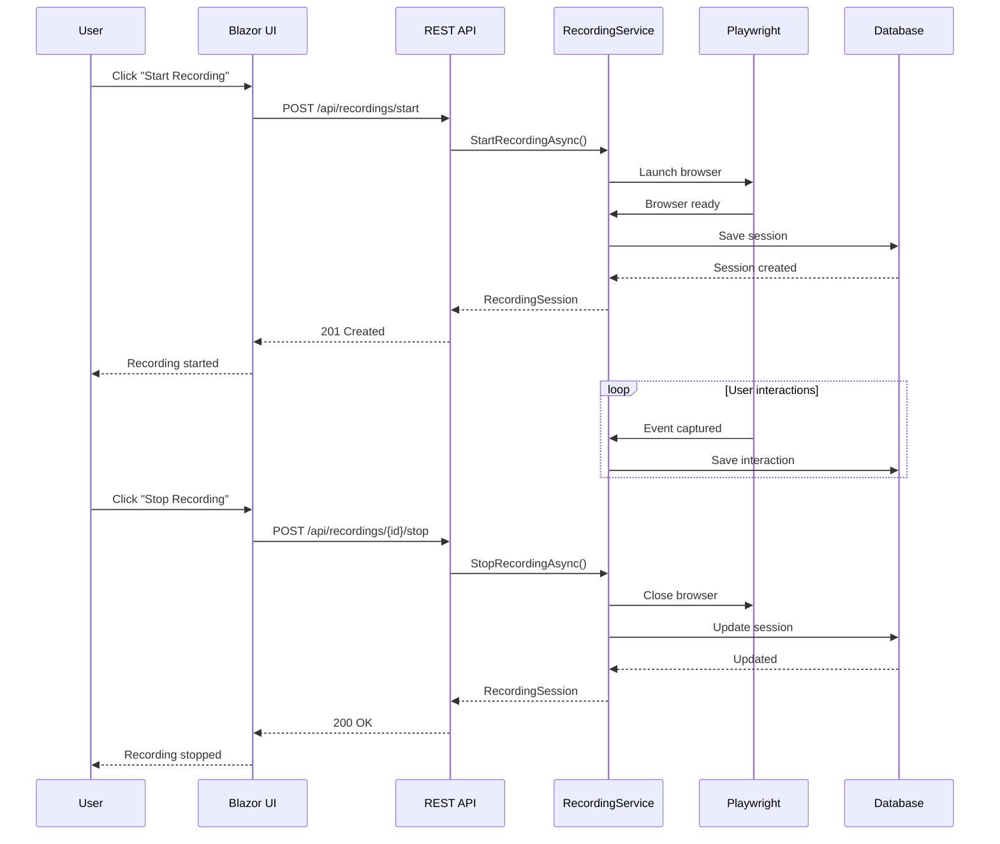
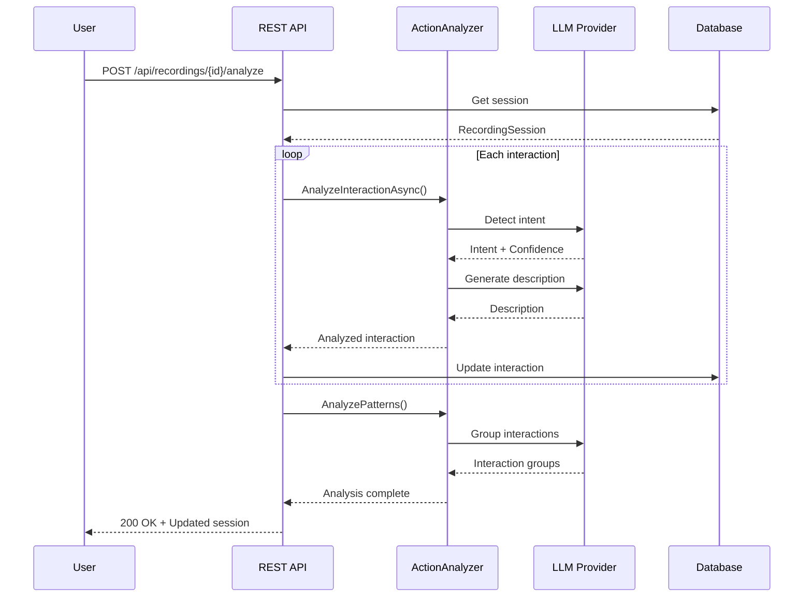
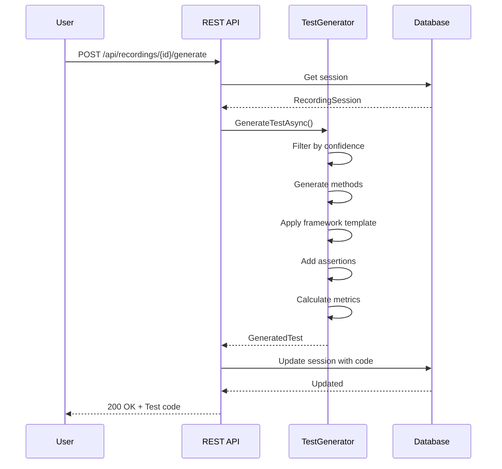

# Test Recording Feature - Architecture

## Overview

This document provides a deep dive into the architecture of the Test Generation from Recordings feature, explaining design decisions, component interactions, and extension points.

## Architecture Principles

### 1. **Separation of Concerns**
- Each layer has a single, well-defined responsibility
- Core domain logic is independent of infrastructure
- UI, API, and business logic are cleanly separated

### 2. **Dependency Inversion**
- High-level modules don't depend on low-level modules
- Both depend on abstractions (interfaces)
- Enables testability and flexibility

### 3. **Event-Driven Design**
- Recording driven by Playwright browser events
- Loose coupling between components
- Supports future real-time streaming

### 4. **AI-First Approach**
- LLM integration at the core
- Fallback mechanisms for reliability
- Confidence scoring for transparency

---

## Layer Architecture

```
???????????????????????????????????????????????????????????????????
?                     Presentation Layer                          ?
?  ????????????????  ????????????????  ????????????????         ?
?  ? Blazor UI    ?  ?  REST API    ?  ?   SignalR    ?         ?
?  ? Components   ?  ?  Endpoints   ?  ?   (Future)   ?         ?
?  ????????????????  ????????????????  ????????????????         ?
?????????????????????????????????????????????????????????????????
          ?                  ?
?????????????????????????????????????????????????????????????????
?                    Application Layer                           ?
?  ????????????????  ????????????????  ????????????????        ?
?  ? RecordingAgt ?  ?ActionAnalyzer?  ?TestGenerator ?        ?
?  ? Orchestrator ?  ?   Service    ?  ?   Service    ?        ?
?  ????????????????  ????????????????  ????????????????        ?
?????????????????????????????????????????????????????????????????
          ?                  ?                  ?
?????????????????????????????????????????????????????????????????
?                      Domain Layer                              ?
?  ????????????????  ????????????????  ????????????????        ?
?  ?  Recording   ?  ? Interaction  ?  ?  Generated   ?        ?
?  ?   Session    ?  ?   Models     ?  ?    Test      ?        ?
?  ????????????????  ????????????????  ????????????????        ?
??????????????????????????????????????????????????????????????????
          ?                  ?                  ?
?????????????????????????????????????????????????????????????????
?                  Infrastructure Layer                          ?
?  ????????????????  ????????????????  ????????????????        ?
?  ?  Playwright  ?  ?  EF Core     ?  ? Azure OpenAI ?        ?
?  ?  Browser     ?  ?  Repository  ?  ?  / Ollama    ?        ?
?  ????????????????  ????????????????  ????????????????        ?
??????????????????????????????????????????????????????????????????
```

---

## Component Details

### 1. Recording Service Layer

#### BrowserRecordingService
**Purpose**: Orchestrates the recording lifecycle

**Responsibilities**:
- Start/stop/pause/resume recording sessions
- Manage Playwright browser instances
- Coordinate event listener attachment
- Track session state

**Key Methods**:
```csharp
Task<RecordingSession> StartRecordingAsync(string name, string url, RecordingConfiguration config)
Task<RecordingSession> StopRecordingAsync(Guid sessionId)
Task PauseRecordingAsync(Guid sessionId)
Task ResumeRecordingAsync(Guid sessionId)
```

**Dependencies**:
- `IBrowserAgent`: Browser automation
- `PlaywrightEventListener`: Event capture
- `InteractionNormalizer`: Data cleaning

#### PlaywrightEventListener
**Purpose**: Capture browser events and convert to interactions

**Event Handling**:
```csharp
// Mouse events
page.Mouse.Click += OnMouseClick
page.Mouse.DblClick += OnMouseDoubleClick

// Keyboard events
page.Keyboard.Down += OnKeyDown
page.Keyboard.Up += OnKeyUp

// Navigation events
page.RequestFinished += OnNavigationComplete
page.FrameNavigated += OnFrameNavigated

// Form events
page.Request += OnFormSubmit
```

**Interaction Creation**:
```csharp
private UserInteraction CreateInteraction(ActionType type, IElementHandle element)
{
    return new UserInteraction
    {
        Id = Guid.NewGuid(),
        ActionType = type,
        Timestamp = DateTimeOffset.UtcNow,
        Context = await CaptureContextAsync(element),
        SequenceNumber = _sequenceNumber++
    };
}
```

#### InteractionNormalizer
**Purpose**: Clean and standardize captured interactions

**Normalization Steps**:
1. **Selector Optimization**: Simplify complex selectors
2. **Text Trimming**: Remove whitespace
3. **Value Normalization**: Standardize input values
4. **Duplicate Detection**: Merge rapid consecutive actions

**Example**:
```csharp
// Before normalization
Selector: "body > div:nth-child(3) > div.container > form#login > input[type='text']"

// After normalization  
Selector: "#login input[type='text']"
```

---

### 2. AI Intelligence Layer

#### ActionAnalyzerService
**Purpose**: AI-powered analysis of user interactions

**Architecture**:
```
User Interaction
    ?
Prompt Builder (Context + History)
    ?
LLM Provider (Azure OpenAI / Ollama)
    ?
Response Parser (JSON extraction)
    ?
Intent + Confidence + Description
```

**Intent Detection Algorithm**:
```csharp
private async Task<(ActionIntent, double)> DetectIntentAsync(
    UserInteraction interaction,
    List<UserInteraction> previousInteractions)
{
    // 1. Build context-aware prompt
    var prompt = BuildIntentDetectionPrompt(interaction, previousInteractions);
    
    // 2. Call LLM with structured output request
    var response = await _llmProvider.CompleteAsync(new LLMRequest
    {
        Model = "gpt-4",
        Temperature = 0.1,  // Low for deterministic classification
        Messages = [
            new Message { Role = MessageRole.System, Content = SystemPrompt },
            new Message { Role = MessageRole.User, Content = prompt }
        ]
    });
    
    // 3. Parse structured JSON response
    var (intent, confidence) = ParseIntentResponse(response.Content);
    
    // 4. Fallback to rule-based if confidence low
    if (confidence < 0.5)
    {
        return (InferIntentFromAction(interaction), 0.5);
    }
    
    return (intent, confidence);
}
```

**Pattern Recognition**:
```csharp
// Groups related interactions into test scenarios
private List<InteractionGroup> AnalyzePatterns(List<UserInteraction> interactions)
{
    // 1. Temporal clustering (actions within time windows)
    var temporalGroups = ClusterByTime(interactions, TimeSpan.FromSeconds(30));
    
    // 2. Intent similarity (actions with same intent)
    var intentGroups = GroupBySimilarIntent(temporalGroups);
    
    // 3. Page flow analysis (actions on same page)
    var pageGroups = GroupByPageFlow(intentGroups);
    
    return pageGroups;
}
```

#### TestGeneratorService
**Purpose**: Generate test code from analyzed interactions

**Code Generation Pipeline**:
```
Recording Session
    ?
Filter by Confidence Threshold
    ?
Generate Test Method(s)
    ?
Apply Framework Template (xUnit/NUnit/MSTest)
    ?
Add Assertions
    ?
Format and Optimize
    ?
Generated Test Code
```

**Template System**:
```csharp
// Framework-specific templates
private const string XUnitPlaywrightTemplate = @"
using System;
using System.Threading.Tasks;
using Microsoft.Playwright;
using Xunit;

namespace {namespace};

public class {className} : IAsyncLifetime
{
    private IPlaywright? _playwright;
    private IBrowser? _browser;
    private IPage? _page;

    public async Task InitializeAsync()
    {
        _playwright = await Playwright.CreateAsync();
        _browser = await _playwright.Chromium.LaunchAsync();
        _page = await _browser.NewPageAsync();
    }

    {testMethods}
}";
```

**Code Generation per Action Type**:
```csharp
private string GenerateCode(UserInteraction interaction)
{
    return interaction.ActionType switch
    {
        ActionType.Click => 
            $"await _page!.Locator(\"{interaction.Context.TargetSelector}\").ClickAsync();",
        
        ActionType.Input => 
            $"await _page!.Locator(\"{interaction.Context.TargetSelector}\").FillAsync(\"{interaction.InputValue}\");",
        
        ActionType.Navigation => 
            $"await _page!.GotoAsync(\"{interaction.Context.Url}\");",
        
        ActionType.Select => 
            $"await _page!.Locator(\"{interaction.Context.TargetSelector}\").SelectOptionAsync(\"{interaction.InputValue}\");",
        
        _ => $"// {interaction.ActionType}: {interaction.Description}"
    };
}
```

---

### 3. Data Persistence Layer

#### Repository Pattern

**Interface**:
```csharp
public interface IRecordingRepository
{
    Task<RecordingSession> CreateSessionAsync(RecordingSession session);
    Task<RecordingSession> UpdateSessionAsync(RecordingSession session);
    Task<RecordingSession?> GetSessionByIdAsync(Guid sessionId);
    Task<List<RecordingSession>> GetSessionsByStatusAsync(RecordingStatus status);
    Task DeleteSessionAsync(Guid sessionId);
    Task AddInteractionAsync(Guid sessionId, UserInteraction interaction);
}
```

**Database Schema**:
```sql
-- RecordingSessions table
CREATE TABLE RecordingSessions (
    Id UNIQUEIDENTIFIER PRIMARY KEY,
    Name NVARCHAR(500) NOT NULL,
    Status NVARCHAR(50) NOT NULL,
    StartedAt DATETIMEOFFSET NOT NULL,
    EndedAt DATETIMEOFFSET NULL,
    ConfigurationJson NVARCHAR(MAX) NOT NULL,
    MetricsJson NVARCHAR(MAX) NOT NULL,
    -- Indexes
    INDEX IX_RecordingSessions_Status (Status),
    INDEX IX_RecordingSessions_StartedAt (StartedAt)
);

-- RecordedInteractions table
CREATE TABLE RecordedInteractions (
    Id UNIQUEIDENTIFIER PRIMARY KEY,
    SessionId UNIQUEIDENTIFIER NOT NULL,
    SequenceNumber INT NOT NULL,
    ActionType NVARCHAR(50) NOT NULL,
    Intent NVARCHAR(50) NOT NULL,
    ContextJson NVARCHAR(MAX) NOT NULL,
    -- Foreign key
    CONSTRAINT FK_Interactions_Sessions 
        FOREIGN KEY (SessionId) 
        REFERENCES RecordingSessions(Id) 
        ON DELETE CASCADE,
    -- Indexes
    INDEX IX_RecordedInteractions_SessionId_Sequence (SessionId, SequenceNumber)
);
```

**JSON Serialization Strategy**:
- Complex objects stored as JSON (Configuration, Metrics, Context)
- Enables flexible schema evolution
- Maintains queryability on key fields
- Balance between normalization and performance

---

### 4. API Layer

#### Endpoint Design

**RESTful Principles**:
```
Resource-based URLs:
  /api/recordings           - Collection
  /api/recordings/{id}      - Individual resource
  /api/recordings/{id}/interactions - Sub-resource

HTTP Verbs:
  GET    - Retrieve resources
  POST   - Create or trigger actions
  DELETE - Remove resources

Response Codes:
  200 - Success
  201 - Created
  204 - No Content
  400 - Bad Request
  404 - Not Found
```

**Endpoint Handler Pattern**:
```csharp
private static async Task<IResult> HandleOperation(
    [FromRoute] Guid id,
    [FromBody] RequestModel request,
    IService service,
    ILogger<Program> logger,
    CancellationToken cancellationToken)
{
    try
    {
        logger.LogInformation("Starting operation for {Id}", id);
        
        var result = await service.ExecuteAsync(id, request, cancellationToken);
        
        return Results.Ok(result);
    }
    catch (NotFoundException ex)
    {
        logger.LogWarning(ex, "Resource not found: {Id}", id);
        return Results.NotFound();
    }
    catch (ValidationException ex)
    {
        logger.LogWarning(ex, "Validation failed");
        return Results.Problem(
            title: "Validation failed",
            detail: ex.Message,
            statusCode: 400
        );
    }
    catch (Exception ex)
    {
        logger.LogError(ex, "Unexpected error");
        return Results.Problem(
            title: "Internal server error",
            detail: ex.Message,
            statusCode: 500
        );
    }
}
```

---

## Data Flow Diagrams

### Recording Flow



### Analysis Flow



### Test Generation Flow



---

## Extension Points

### 1. Adding New Action Types

**Steps**:
1. Add enum value to `ActionType`
2. Update `PlaywrightEventListener` event handlers
3. Add intent mapping in `ActionAnalyzerService`
4. Add code generation in `TestGeneratorService`

**Example**:
```csharp
// 1. ActionType.cs
public enum ActionType
{
    // ...existing
    DragAndDrop
}

// 2. PlaywrightEventListener.cs
page.DragDrop += async (sender, args) =>
{
    var interaction = new UserInteraction
    {
        ActionType = ActionType.DragAndDrop,
        // ...
    };
    await _recordingService.AddInteractionAsync(interaction);
};

// 3. ActionAnalyzerService.cs
ActionType.DragAndDrop => ActionIntent.DataManipulation

// 4. TestGeneratorService.cs
private string GenerateDragAndDropCode(UserInteraction interaction)
{
    return $"await _page!.Locator(\"{interaction.Context.TargetSelector}\").DragToAsync(target);";
}
```

### 2. Adding New Test Frameworks

**Steps**:
1. Create template in `TestCodeTemplates`
2. Add framework detection in `TestGeneratorService`
3. Add imports mapping

**Example**:
```csharp
// 1. Template
public const string SpecFlowTemplate = @"
using TechTalk.SpecFlow;
using Microsoft.Playwright;

namespace {namespace};

[Binding]
public class {className}
{
    private IPage? _page;

    [Given(@""I navigate to (.*)"")] 
    public async Task GivenINavigateTo(string url)
    {
        await _page!.GotoAsync(url);
    }
    
    {testMethods}
}";

// 2. Framework detection
private string GetClassTemplate(string framework) => framework switch
{
    "xunit" => TestCodeTemplates.XUnitPlaywrightTemplate,
    "nunit" => TestCodeTemplates.NUnitPlaywrightTemplate,
    "mstest" => TestCodeTemplates.MSTestPlaywrightTemplate,
    "specflow" => TestCodeTemplates.SpecFlowTemplate,
    _ => TestCodeTemplates.XUnitPlaywrightTemplate
};
```

### 3. Adding New LLM Providers

**Steps**:
1. Implement `ILLMProvider` interface
2. Add to `LLMProviderFactory`
3. Add configuration section

**Example**:
```csharp
// 1. Implementation
public class AnthropicProvider : ILLMProvider
{
    public string Name => "Anthropic";
    
    public async Task<LLMResponse> CompleteAsync(
        LLMRequest request,
        CancellationToken cancellationToken)
    {
        // Implementation
    }
}

// 2. Factory
case "Anthropic":
    return new AnthropicProvider(config);

// 3. Configuration
{
  "EvoAITest": {
    "Core": {
      "LLMProvider": "Anthropic",
      "Anthropic": {
        "ApiKey": "your-key",
        "Model": "claude-3-opus"
      }
    }
  }
}
```

---

## Performance Considerations

### 1. Database Optimization

**Indexes**:
```csharp
// Session lookup by status and date
entity.HasIndex(e => new { e.Status, e.StartedAt });

// Interaction lookup by session
entity.HasIndex(e => new { e.SessionId, e.SequenceNumber });
```

**Connection Pooling**:
```csharp
services.AddDbContext<EvoAIDbContext>(options =>
    options.UseSqlServer(connectionString, sqlOptions =>
    {
        sqlOptions.EnableRetryOnFailure(maxRetryCount: 5);
        sqlOptions.CommandTimeout(60);
    }));
```

### 2. LLM Call Optimization

**Batching**:
```csharp
// Analyze multiple interactions in one call
var batch = interactions.Take(10);
var analysisPrompt = BuildBatchAnalysisPrompt(batch);
```

**Caching**:
```csharp
// Cache intent detection for similar actions
private readonly Dictionary<string, (ActionIntent, double)> _intentCache;
```

**Temperature Settings**:
```csharp
// Lower temperature for classification (deterministic)
Temperature = 0.1 for intent detection

// Higher temperature for generation (creative)
Temperature = 0.7 for test name generation
```

### 3. Memory Management

**Streaming Interactions**:
```csharp
// Don't load all interactions in memory
await foreach (var interaction in GetInteractionsStreamAsync(sessionId))
{
    await ProcessInteractionAsync(interaction);
}
```

**Dispose Pattern**:
```csharp
public sealed class RecordingService : IRecordingService, IDisposable
{
    public void Dispose()
    {
        _browser?.DisposeAsync();
        _playwright?.Dispose();
    }
}
```

---

## Security Considerations

### 1. Input Validation

```csharp
// Sanitize user inputs
private string SanitizeClassName(string name)
{
    return Regex.Replace(name, @"[^a-zA-Z0-9_]", "");
}
```

### 2. Sensitive Data Masking

```csharp
private string MaskSensitiveData(string value)
{
    // Mask passwords
    if (value.All(c => c == '*'))
        return "[PASSWORD]";
    
    // Mask emails
    if (value.Contains('@'))
        return $"{value[0]}***@{value.Split('@')[1]}";
    
    return value;
}
```

### 3. API Authentication

```csharp
// Add JWT Bearer authentication in production
builder.Services.AddAuthentication(JwtBearerDefaults.AuthenticationScheme)
    .AddJwtBearer(options =>
    {
        options.TokenValidationParameters = new TokenValidationParameters
        {
            ValidateIssuer = true,
            ValidateAudience = true,
            ValidateLifetime = true
        };
    });
```

---

## Testing Strategy

### 1. Unit Tests
- Test individual services in isolation
- Mock dependencies (ILLMProvider, IBrowserAgent)
- Verify business logic

### 2. Integration Tests
- Test API endpoints
- Use in-memory database
- Verify data persistence

### 3. End-to-End Tests
- Test complete recording flow
- Use TestServer for API
- Verify generated test code compiles

---

**Version**: 1.0.0  
**Last Updated**: December 2024
