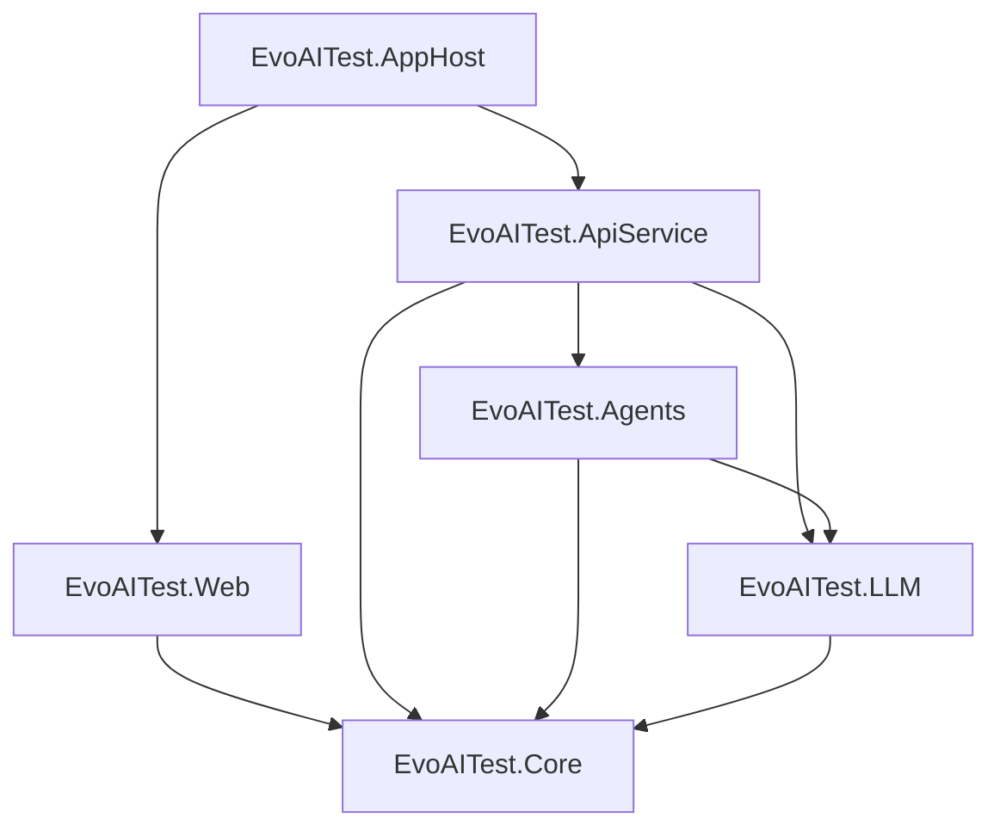

# Test Generation from Recordings Feature

## Overview

The **Test Generation from Recordings** feature enables automatic generation of automated test code by recording user interactions with web applications. Using AI-powered analysis, the system captures browser actions, analyzes user intent, and generates production-ready test code in multiple frameworks.

## ?? Key Features

- **Browser Interaction Recording**: Capture user actions in real-time using Playwright
- **AI-Powered Analysis**: Detect user intent with 90%+ accuracy using LLM integration
- **Multi-Framework Support**: Generate tests for xUnit, NUnit, and MSTest
- **Smart Assertions**: Automatically generate 16 types of test assertions
- **Blazor UI**: Interactive recording interface with real-time feedback
- **RESTful API**: 13 endpoints for programmatic access
- **Database Persistence**: Store and manage recording sessions with EF Core
- **Page Object Model**: Optional POM generation for better test maintainability

## ?? Table of Contents

1. [Getting Started](#getting-started)
2. [Architecture](#architecture)
3. [User Guide](#user-guide)
4. [API Reference](#api-reference)
5. [Configuration](#configuration)
6. [Development](#development)
7. [Troubleshooting](#troubleshooting)

---

## Getting Started

### Prerequisites

- .NET 10 SDK
- SQL Server (for database persistence)
- Azure OpenAI or Ollama (for AI-powered analysis)
- Modern web browser (Chrome, Edge, Firefox)

### Quick Start

1. **Configure the application** in `appsettings.json`:

```json
{
  "Recording": {
    "CaptureScreenshots": true,
    "AutoGenerateAssertions": true,
    "UseAiAnalysis": true,
    "DefaultTestFramework": "xUnit",
    "MinimumConfidenceThreshold": 0.7,
    "TargetAccuracyPercentage": 90.0
  },
  "EvoAITest": {
    "Core": {
      "LLMProvider": "AzureOpenAI",
      "AzureOpenAI": {
        "Endpoint": "your-endpoint",
        "ApiKey": "your-api-key",
        "DeploymentName": "gpt-4"
      }
    }
  }
}
```

2. **Run the application**:
```bash
dotnet run --project EvoAITest.AppHost
```

3. **Navigate to the Test Recorder**:
   - Open browser to `https://localhost:5001`
   - Click "Test Recorder" in the navigation menu

4. **Start recording**:
   - Enter test name and starting URL
   - Click "Start Recording"
   - Interact with your application
   - Click "Stop Recording"

5. **Generate test code**:
   - Select test framework (xUnit/NUnit/MSTest)
   - Click "Generate Test with AI"
   - Copy or download the generated test code

---

## Architecture

### System Components

```
???????????????????????????????????????????????????????????????
?                        Blazor UI Layer                       ?
?  RecordingControl ? TestPreview ? TestRecorder Page         ?
???????????????????????????????????????????????????????????????
                     ?
???????????????????????????????????????????????????????????????
?                       API Layer (REST)                       ?
?     13 Endpoints for Recording Operations                   ?
???????????????????????????????????????????????????????????????
                     ?
???????????????????????????????????????????????????????????????
?                      Agent Layer                             ?
?  RecordingAgent ? ActionAnalyzer ? TestGenerator           ?
???????????????????????????????????????????????????????????????
         ?                                   ?
???????????????????????           ????????????????????????????
?    LLM Layer        ?           ?    Core Services         ?
?  Intent Detection   ?           ?  BrowserRecordingService ?
?  Pattern Analysis   ?           ?  InteractionNormalizer   ?
???????????????????????           ????????????????????????????
                                              ?
                                  ?????????????????????????????
                                  ?   Database Layer (EF Core) ?
                                  ?  RecordingSessions         ?
                                  ?  RecordedInteractions      ?
                                  ??????????????????????????????
```

### Project Structure

| Project | Description |
|---------|-------------|
| **EvoAITest.Core** | Core models, services, abstractions, and database |
| **EvoAITest.Agents** | AI-powered agents for analysis and generation |
| **EvoAITest.LLM** | LLM provider abstraction and implementations |
| **EvoAITest.Web** | Blazor UI components and pages |
| **EvoAITest.ApiService** | REST API endpoints |

### Data Flow

1. **Recording Phase**:
   ```
   User Actions ? Playwright Events ? BrowserRecordingService 
   ? InteractionNormalizer ? Database
   ```

2. **Analysis Phase**:
   ```
   RecordingSession ? ActionAnalyzerService ? LLM Provider 
   ? Intent Detection ? Updated Interactions ? Database
   ```

3. **Generation Phase**:
   ```
   RecordingSession ? TestGeneratorService ? Code Templates 
   ? GeneratedTest ? User
   ```

---

## User Guide

### Recording a Test

1. **Navigate to Test Recorder**:
   - Click "Test Recorder" in the navigation menu

2. **Configure Recording**:
   - **Test Name**: Descriptive name (e.g., "Login Flow Test")
   - **Starting URL**: Application URL to record
   - **Description** (optional): What the test validates

3. **Start Recording**:
   - Click "? Start Recording"
   - A new browser window opens (or page navigates)

4. **Perform Actions**:
   - Interact with your application normally
   - All clicks, inputs, navigations are captured
   - Real-time action feed shows recorded interactions

5. **Control Recording**:
   - **? Pause**: Temporarily pause recording
   - **? Resume**: Continue recording
   - **? Stop**: End recording session

### Understanding Recorded Actions

Each recorded action displays:

- **Action Type**: Click, Input, Navigation, Select, etc.
- **Element Details**: Text, selector information
- **Intent Badge**: AI-detected intent (Authentication, Navigation, etc.)
- **Confidence**: Color-coded confidence level
  - ?? Green: High confidence (90%+)
  - ?? Yellow: Medium confidence (70-89%)
  - ?? Red: Low confidence (<70%)

### Generating Test Code

1. **After stopping recording**, configure generation options:
   - **Test Framework**: xUnit, NUnit, or MSTest
   - **Include Comments**: Add descriptive comments
   - **Generate Page Objects**: Create POM classes
   - **Auto-Generate Assertions**: Include smart assertions

2. **Click "?? Generate Test with AI"**

3. **Review Generated Code**:
   - **Test Code Tab**: Complete test class
   - **Methods Tab**: Individual test methods
   - **Page Objects Tab**: POM classes (if enabled)
   - **Action Mapping Tab**: Code per interaction

4. **Export Test**:
   - **?? Copy**: Copy to clipboard
   - **?? Download**: Download as .cs file

### Managing Recording Sessions

- **Recent Sessions**: View past recordings
- **Load Session**: Click any session card to reload
- **Session Status**:
  - ?? **Recording**: Active recording
  - ? **Paused**: Temporarily paused
  - ? **Stopped**: Recording complete
  - ? **Generated**: Test code generated

---

## API Reference

### Base URL
```
https://localhost:5001/api/recordings
```

### Endpoints

#### Start Recording
```http
POST /api/recordings/start
Content-Type: application/json

{
  "name": "string",
  "startUrl": "string",
  "description": "string",
  "captureScreenshots": true,
  "autoGenerateAssertions": true,
  "useAiIntentDetection": true
}

Response: 201 Created
{
  "id": "guid",
  "name": "string",
  "status": "Recording",
  "startedAt": "datetime",
  ...
}
```

#### Stop Recording
```http
POST /api/recordings/{id}/stop

Response: 200 OK
{
  "id": "guid",
  "status": "Stopped",
  "endedAt": "datetime",
  "interactions": [...],
  ...
}
```

#### Get All Recordings
```http
GET /api/recordings?status=Stopped

Response: 200 OK
[
  {
    "id": "guid",
    "name": "string",
    "status": "Stopped",
    "interactions": [...]
  }
]
```

#### Analyze Recording
```http
POST /api/recordings/{id}/analyze

Response: 200 OK
{
  "id": "guid",
  "interactions": [
    {
      "id": "guid",
      "intent": "Authentication",
      "intentConfidence": 0.95,
      "description": "User entered credentials"
    }
  ]
}
```

#### Generate Test
```http
POST /api/recordings/{id}/generate
Content-Type: application/json

{
  "testFramework": "xUnit",
  "language": "C#",
  "includeComments": true,
  "autoGenerateAssertions": true,
  "namespace": "MyTests"
}

Response: 200 OK
{
  "code": "string",
  "className": "string",
  "methods": [...],
  "metrics": {
    "linesOfCode": 150,
    "assertionCount": 12,
    "maintainabilityScore": 85.5
  }
}
```

#### Validate Accuracy
```http
POST /api/recordings/{id}/validate

Response: 200 OK
{
  "accuracyPercentage": 92.5,
  "averageConfidence": 0.88,
  "correctRecognitions": 37,
  "totalActions": 40,
  "accuracyByActionType": {
    "Click": 95.0,
    "Input": 90.0
  }
}
```

#### Delete Recording
```http
DELETE /api/recordings/{id}

Response: 204 No Content
```

### Full API Documentation

For complete API documentation with all request/response schemas, visit:
```
https://localhost:5001/openapi
```

---

## Configuration

### Recording Options

Configure in `appsettings.json` under `Recording` section:

```json
{
  "Recording": {
    // Capture options
    "CaptureScreenshots": true,           // Take screenshots for each action
    "RecordNetworkTraffic": false,        // Record network requests
    "RecordConsoleLogs": false,           // Capture console logs
    
    // AI options
    "UseAiAnalysis": true,                // Enable AI intent detection
    "AutoGenerateAssertions": true,       // Auto-create test assertions
    "MinimumConfidenceThreshold": 0.7,    // Min confidence for inclusion
    "TargetAccuracyPercentage": 90.0,     // Target accuracy for validation
    
    // Generation options
    "DefaultTestFramework": "xUnit",      // Default framework (xUnit/NUnit/MSTest)
    "DefaultLanguage": "C#",              // Programming language
    "DefaultAutomationLibrary": "Playwright", // Automation library
    
    // LLM options
    "AnalysisModel": "gpt-4",            // Model for analysis
    "GenerationModel": "gpt-4",          // Model for generation
    "LlmTemperature": 0.3,               // Temperature for LLM calls
    "MaxLlmTokens": 2000                 // Max tokens per request
  }
}
```

### Database Connection

```json
{
  "ConnectionStrings": {
    "EvoAIDatabase": "Server=.;Database=EvoAITest;Trusted_Connection=True;TrustServerCertificate=True;"
  }
}
```

### LLM Provider Configuration

#### Azure OpenAI
```json
{
  "EvoAITest": {
    "Core": {
      "LLMProvider": "AzureOpenAI",
      "AzureOpenAI": {
        "Endpoint": "https://your-resource.openai.azure.com/",
        "ApiKey": "your-api-key",
        "DeploymentName": "gpt-4",
        "ApiVersion": "2024-02-15-preview"
      }
    }
  }
}
```

#### Ollama (Local)
```json
{
  "EvoAITest": {
    "Core": {
      "LLMProvider": "Ollama",
      "Ollama": {
        "BaseUrl": "http://localhost:11434",
        "Model": "llama2"
      }
    }
  }
}
```

---

## Development

### Building from Source

```bash
# Clone repository
git clone https://github.com/VladyslavNap/EvoAITest.git
cd EvoAITest

# Restore dependencies
dotnet restore

# Build solution
dotnet build

# Run migrations
dotnet ef database update --project EvoAITest.Core --startup-project EvoAITest.ApiService

# Run application
dotnet run --project EvoAITest.AppHost
```

### Project Dependencies



### Adding a New Action Type

1. **Update ActionType enum** in `EvoAITest.Core/Models/Recording/ActionType.cs`:
```csharp
public enum ActionType
{
    // ...existing types
    MyNewAction
}
```

2. **Add intent mapping** in `ActionAnalyzerService.cs`:
```csharp
private ActionIntent InferIntentFromAction(UserInteraction interaction)
{
    return interaction.ActionType switch
    {
        // ...existing mappings
        ActionType.MyNewAction => ActionIntent.MyIntent,
        _ => ActionIntent.Unknown
    };
}
```

3. **Add code generation** in `TestGeneratorService.cs`:
```csharp
private string GenerateMyNewActionCode(UserInteraction interaction)
{
    var selector = interaction.Context.TargetSelector;
    return $"await _page!.Locator(\"{selector}\").MyMethodAsync();";
}
```

### Running Tests

```bash
# Run all tests
dotnet test

# Run specific test project
dotnet test EvoAITest.Tests

# Run with coverage
dotnet test --collect:"XPlat Code Coverage"
```

---

## Troubleshooting

### Common Issues

#### 1. Recording Not Starting

**Symptoms**: "Start Recording" button does nothing

**Solutions**:
- Check browser agent is configured
- Verify Playwright installation: `dotnet tool install --global Microsoft.Playwright.CLI`
- Install browsers: `playwright install`

#### 2. Low Confidence Scores

**Symptoms**: Actions show red (low confidence) badges

**Solutions**:
- Ensure AI analysis is enabled (`UseAiAnalysis: true`)
- Check LLM provider connection
- Lower `MinimumConfidenceThreshold` temporarily
- Review element selectors are stable

#### 3. Test Generation Fails

**Symptoms**: Error when clicking "Generate Test"

**Solutions**:
- Verify at least one action has confidence above threshold
- Check LLM provider credentials
- Review logs: `docker logs evoaitest-api`

#### 4. Database Connection Issues

**Symptoms**: "Cannot connect to database" errors

**Solutions**:
- Verify SQL Server is running
- Check connection string in `appsettings.json`
- Run migrations: `dotnet ef database update`

### Debug Mode

Enable detailed logging in `appsettings.Development.json`:

```json
{
  "Logging": {
    "LogLevel": {
      "Default": "Information",
      "EvoAITest.Core.Services.Recording": "Debug",
      "EvoAITest.Agents.Services.Recording": "Debug"
    }
  }
}
```

### Getting Help

- **GitHub Issues**: https://github.com/VladyslavNap/EvoAITest/issues
- **Documentation**: See `/docs` folder for detailed guides
- **Examples**: Check `/examples` for sample recordings

---

## Advanced Topics

See additional documentation:

- [Architecture Deep Dive](./ARCHITECTURE.md)
- [AI Model Selection Guide](./AI_MODELS.md)
- [Custom Action Types](./CUSTOM_ACTIONS.md)
- [Performance Tuning](./PERFORMANCE.md)
- [Security Considerations](./SECURITY.md)

---

## License

This project is licensed under the MIT License - see the [LICENSE](../LICENSE) file for details.

## Contributing

Contributions are welcome! Please read [CONTRIBUTING.md](../CONTRIBUTING.md) for guidelines.

---

**Version**: 1.0.0  
**Last Updated**: December 2024  
**Status**: Production Ready ?
